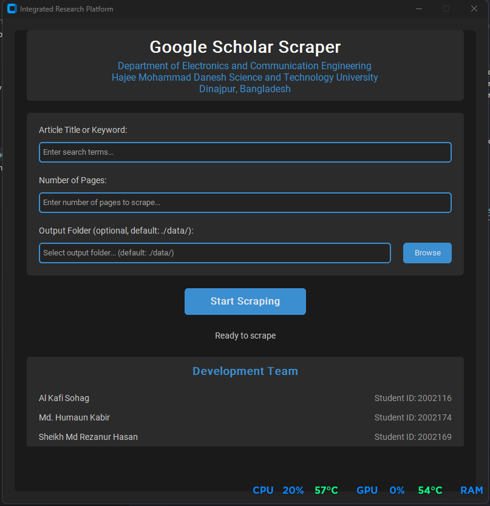

# Integrated Research Platform

A powerful tool designed to streamline academic research by efficiently scraping and organizing scholarly articles from Google Scholar.



## Features

- **Smart Article Scraping**: Automatically fetch research papers from Google Scholar
- **Advanced Search**: Search by keywords, titles, or specific research topics
- **Progress Tracking**: Real-time progress monitoring during the scraping process
- **Organized Output**: Results saved in Excel format with essential metadata
- **User-Friendly Interface**: Modern, intuitive dark-themed GUI
- **Customizable Storage**: Choose where to save your research data
- **Error Handling**: Robust error management with clear user feedback

## Installation Guide

### Step 1: Install Python (If not installed)

1. Visit the [Python Downloads Page](https://www.python.org/downloads/)
2. Download the latest Python version (3.8 or newer)
3. Run the installer
   - Check "Add Python to PATH" during installation
   - Click "Install Now"
4. Verify installation by opening Command Prompt (Windows) and typing:
   ```
   python --version
   ```

### Step 2: Download the Project

1. Clone the repository:
   ```bash
   git clone https://github.com/al-kafi-sohag/integrated-research-platform.git
   cd integrated-research-platform
   ```

### Step 3: Set Up Virtual Environment

1. Create a virtual environment:
   ```bash
   python -m venv venv
   ```

2. Activate the virtual environment:
   - On Windows:
     ```bash
     venv\Scripts\activate
     ```
   - On macOS/Linux:
     ```bash
     source venv/bin/activate
     ```

### Step 4: Install Dependencies

1. With the virtual environment activated, install required packages:
   ```bash
   pip install -r requirements.txt
   ```

## How to Use

1. **Start the Application**
   - Double-click `main.py` or run in Command Prompt:
     ```
     python main.py
     ```

2. **Search for Articles**
   - Enter your search terms in "Article Title or Keyword"
   - Specify the number of pages to scrape
   - (Optional) Choose a custom output folder

3. **Run the Search**
   - Click "Start Scraping"
   - Wait for the process to complete
   - Results will be saved automatically

4. **Access Results**
   - Click "Open File" to view the Excel file
   - Find your results in the 'data' folder (or your chosen location)

## Tips for Better Results

- Use specific keywords for more focused results
- Start with a small number of pages for quick testing
- Allow sufficient time for thorough scraping
- Check the status bar for progress updates

## Development Team

### Project Members
- **Al Kafi Sohag**
- **Md. Humaun Kabir**
- **Sheikh Md Rezanur Hasan**

### Institution
Department of Electronics and Communication Engineering  
Hajee Mohammad Danesh Science and Technology University  
Dinajpur, Bangladesh

## Contributing

We welcome contributions! Please feel free to submit a Pull Request.

## License

This project is licensed under the MIT License - see the LICENSE file for details.
